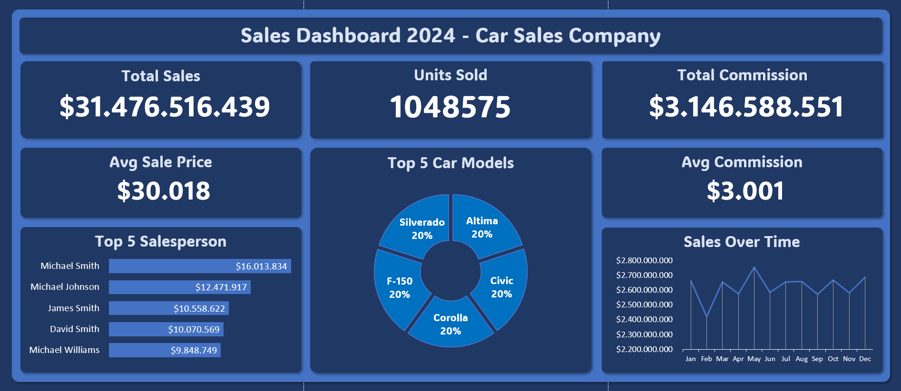

# 🚗 Car Sales Dashboard (Excel Project)

## 📌 Deskripsi
Proyek ini bertujuan untuk menganalisis data penjualan mobil dan memvisualisasikannya dalam bentuk dashboard menggunakan **Microsoft Excel**.

Dashboard ini menampilkan performa penjualan, komisi, dan model mobil terpopuler, serta memberikan gambaran umum performa sales setiap bulan.

---

## 🧰 Tools & Dataset
- **Tools**: Microsoft Excel (Pivot Table, Chart, Conditional Formatting)
- **Dataset**: Data penjualan mobil (berisi tanggal penjualan, nama sales, model mobil, jumlah, komisi)

[Link Dataset](https://www.kaggle.com/datasets/suraj520/car-sales-data/data)

---

## 📊 Tampilan Dashboard

---

## 📈 Insight Penting
- **Total Penjualan**: $31.476.516.439 dari 1.048.575 unit.
- **Model Mobil Terpopuler**: Civic, Corolla, Altima, Silverado, F-150 (masing-masing 20%)
- **Sales Terbaik**: Michael Smith ($16.013.834)
- **Bulan Tertinggi**: Mei menunjukkan puncak penjualan tahunan.

---

## 📂 Struktur File
| File/Folder | Keterangan |
|-------------|------------|
| `dashboard/car_sales_dashboard.png` | Tampilan visual dari dashboard Excel |
| `README.md` | Deskripsi proyek ini |

---

## 🧠 Value Bisnis
Dashboard ini membantu manajemen untuk:
- Mengidentifikasi **sales top performer**
- Melacak **tren penjualan per bulan**
- Menentukan **model mobil paling laku**
- Menganalisis **rata-rata komisi dan harga jual**

---

## ✍️ Author
8shagrid

[LinkedIn](https://linkedin.com/in/dirgahalimsusilo) • [GitHub](https://github.com/8shagrid)
